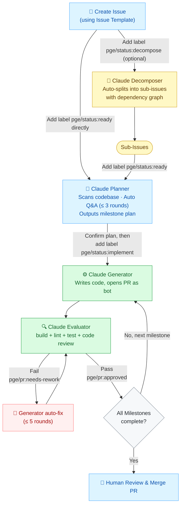

# ai-workflows-hub

A shared library of AI-driven development workflows. Any GitHub repo can reference it via Reusable Workflows — zero infrastructure, zero ops.

AI model calls are powered by **AWS Bedrock (Claude)**, authenticated via GitHub OIDC to assume an IAM Role without storing credentials.

**English** · [中文文档](./README.zh-CN.md)

---

## How It Works

Label an Issue — Claude plans, implements, and reviews the code automatically.



---

## Contents

### Reference-based (use `uses:` to reference directly)

| File | Type | Description |
|------|------|-------------|
| `.github/actions/claude-bedrock/` | Composite Action | Core: invoke AWS Bedrock Claude with OIDC auth |
| `.github/actions/jira-handler/` | Composite Action | Create Jira issues via REST API |
| `.github/actions/teams-handler/` | Composite Action | Send Microsoft Teams notifications |
| `.github/workflows/claude-plan.yml` | Reusable Workflow | PGE Planner — analyze issue, auto Q&A, generate milestone plan |
| `.github/workflows/claude-implement.yml` | Reusable Workflow | PGE Generator + Rework — implement code, open PR |
| `.github/workflows/claude-evaluate.yml` | Reusable Workflow | PGE Evaluator + Milestone Advance — review PR, advance milestones |
| `.github/workflows/claude-code-review.yml` | Reusable Workflow | Code Review — lightweight review for human-authored PRs |
| `.github/workflows/claude-decompose.yml` | Reusable Workflow | Decomposer — split a large issue into sub-issues with dependencies |
| `.github/workflows/cloudwatch-debug.yml` | Reusable Workflow | CloudWatch log polling → Claude analysis → Jira/Teams |

### Template-based (copy once from `templates/`)

| File | Description |
|------|-------------|
| `templates/labels.yml` | PGE label set, import with `gh label import` |
| `templates/ISSUE_TEMPLATE/` | Issue templates (prd / bug / change-request) |
| `templates/CLAUDE.md.template` | CLAUDE.md scaffold |
| `templates/cursor-skills/clean-code/SKILL.md` | Cross-repo code quality baseline |
| `templates/cursor-skills/refactor/SKILL.md` | Cross-repo refactoring protocol |

---

## Onboarding a New Repo — Complete Steps

### Prerequisites

- The target repo is hosted on GitHub
- You have an AWS account with a Bedrock-enabled IAM Role (see Step 2)
- [`gh` CLI](https://cli.github.com/) is installed and authenticated locally (used in Steps 1, 5, 7)
- `jq` is installed locally (required by the `claude-bedrock` action; it will fail immediately if missing)

---

### Step 1: Copy Template Files

```bash
# Clone the library
gh repo clone tiankai0114/ai-workflows-hub /tmp/ai-workflows-hub

# Navigate to your repo root
cd /path/to/your-repo

# Copy templates
cp /tmp/ai-workflows-hub/templates/labels.yml .github/labels.yml
cp -r /tmp/ai-workflows-hub/templates/ISSUE_TEMPLATE .github/ISSUE_TEMPLATE
cp /tmp/ai-workflows-hub/templates/CLAUDE.md.template CLAUDE.md
mkdir -p .cursor/skills
cp -r /tmp/ai-workflows-hub/templates/cursor-skills/clean-code .cursor/skills/
cp -r /tmp/ai-workflows-hub/templates/cursor-skills/refactor .cursor/skills/
```

### Step 2: Configure AWS IAM Role (Trust Policy)

In the AWS Console, find the IAM Role used for Bedrock, edit **Trust relationships**, and add the following Statement (replace `YOUR_ACCOUNT_ID` and `YOUR_ORG/YOUR_REPO`):

```json
{
  "Effect": "Allow",
  "Principal": {
    "Federated": "arn:aws:iam::YOUR_ACCOUNT_ID:oidc-provider/token.actions.githubusercontent.com"
  },
  "Action": "sts:AssumeRoleWithWebIdentity",
  "Condition": {
    "StringEquals": {
      "token.actions.githubusercontent.com:aud": "sts.amazonaws.com"
    },
    "StringLike": {
      "token.actions.githubusercontent.com:sub": "repo:YOUR_ORG/YOUR_REPO:*"
    }
  }
}
```

> **Note:** The `sub` condition must specify a full repo path (e.g. `repo:tiankai0114/search-android-demo-app:*`). Broad wildcards like `repo:tiankai0114/*:*` will be rejected by AWS.
>
> Each additional repo requires a new `sub` condition entry in this Trust Policy.

Also attach the following permission policy to allow Bedrock calls:

```json
{
  "Effect": "Allow",
  "Action": [
    "bedrock:InvokeModel",
    "bedrock:InvokeModelWithResponseStream"
  ],
  "Resource": "*"
}
```

Note the Role ARN in the format: `arn:aws:iam::YOUR_ACCOUNT_ID:role/YOUR_ROLE_NAME`

---

### Step 3: Create a GitHub App (for Generator to commit as a bot)

> Code Review, Decompose, and Plan do not require a GitHub App; Implement and Evaluate do.

1. Open [github.com/settings/apps/new](https://github.com/settings/apps/new)
2. Fill in:
   - **App name**: `your-repo-ci` (prefix with your repo name; must be globally unique)
   - **Homepage URL**: `https://github.com/your-org`
   - **Webhook**: uncheck Active
3. Set **Permissions** (Repository permissions):
   - Contents: **Read & Write**
   - Issues: **Read & Write**
   - Pull requests: **Read & Write**
4. **Where can this GitHub App be installed**: Only on this account
5. Click **Create GitHub App**
6. Note the **App ID** (number) at the top of the page
7. Scroll down, click **Generate a private key** → download the `.pem` file

**Install the App to your target repo:**

1. Click **Install App** in the left sidebar
2. Click **Install** next to your account
3. Choose **Only select repositories** → select the target repo → confirm

**Look up the bot's numeric User ID:**

```bash
# Replace your-app-name with the App name (lowercase, spaces to hyphens)
curl https://api.github.com/users/your-app-name%5Bbot%5D | grep '"id"'
```

Or visit in your browser: `https://api.github.com/users/your-app-name[bot]`

Note the returned `"id"` value (this is the `bot_id`).

---

### Step 4: Add Secrets to the Target Repo

Go to target repo → **Settings → Secrets and variables → Actions → New repository secret**:

| Secret Name | Value | Required For |
|-------------|-------|--------------|
| `GH_APP_ID` | GitHub App numeric ID | Implement / Evaluate |
| `GH_APP_PRIVATE_KEY` | Full `.pem` file contents (including header/footer lines) | Implement / Evaluate |
| `FIGMA_TOKEN` | Figma Personal Access Token | Optional — only when Figma designs are referenced |

---

### Step 5: Import PGE Labels

```bash
cd /path/to/your-repo
gh label import .github/labels.yml --repo YOUR_ORG/YOUR_REPO
```

> Requires `gh auth login` with a token that has `write:repo` permission.

---

### Step 6: Commit Templates to the Default Branch

Issue Templates only appear on GitHub's "New Issue" page when they are on the default branch:

```bash
git add .github/ISSUE_TEMPLATE .github/labels.yml CLAUDE.md .cursor/
git commit -m "chore: add PGE issue templates, CLAUDE.md and skill files"
git push origin main   # or master, depending on your default branch
```

---

### Step 7: Add Trigger Workflow Files

Create the following files under `.github/workflows/` in your target repo. Replace `YOUR_ROLE_ARN`, `YOUR_BOT_NAME`, and `YOUR_BOT_ID`:

**`pge-code-review.yml`** — Auto code review for human-authored PRs

```yaml
name: "Claude: Code Review"
on:
  pull_request:
    types: [opened, synchronize, ready_for_review, reopened]
jobs:
  review:
    if: |
      !endsWith(github.event.pull_request.user.login, '[bot]') &&
      !contains(github.event.pull_request.title, '[Milestone') &&
      !endsWith(github.event.sender.login, '[bot]')
    uses: tiankai0114/ai-workflows-hub/.github/workflows/claude-code-review.yml@v1
    with:
      aws_role: "YOUR_ROLE_ARN"
```

**`pge-decompose.yml`** — Split a large issue into sub-issues

```yaml
name: "Claude: Decompose"
on:
  issues:
    types: [labeled]
jobs:
  decompose:
    if: github.event.label.name == 'pge/status:decompose'
    uses: tiankai0114/ai-workflows-hub/.github/workflows/claude-decompose.yml@v1
    with:
      aws_role: "YOUR_ROLE_ARN"
```

**`pge-plan.yml`** — Analyze issue, generate implementation plan

```yaml
name: "Claude: Planner"
on:
  issues:
    types: [labeled]
jobs:
  plan:
    if: github.event.label.name == 'pge/status:ready'
    uses: tiankai0114/ai-workflows-hub/.github/workflows/claude-plan.yml@v1
    with:
      aws_role: "YOUR_ROLE_ARN"
      bot_id: "YOUR_BOT_ID"
      bot_name: "YOUR_BOT_NAME[bot]"
    secrets:
      figma_token: ${{ secrets.FIGMA_TOKEN }}
```

**`pge-implement.yml`** — Implement code + Rework

```yaml
name: "Claude: Generator"
on:
  issues:
    types: [labeled]
  pull_request:
    types: [labeled]
jobs:
  run:
    if: |
      (github.event_name == 'issues' && github.event.label.name == 'pge/status:implement') ||
      (github.event_name == 'pull_request' && github.event.label.name == 'pge/pr:needs-rework')
    uses: tiankai0114/ai-workflows-hub/.github/workflows/claude-implement.yml@v1
    with:
      aws_role: "YOUR_ROLE_ARN"
      bot_id: "YOUR_BOT_ID"
      bot_name: "YOUR_BOT_NAME[bot]"
      mode: ${{ (github.event_name == 'pull_request' && github.event.label.name == 'pge/pr:needs-rework') && 'rework' || 'implement' }}
      pr_number: ${{ github.event.pull_request.number || '' }}
      # evaluator_workflow_name defaults to "Claude: Evaluator".
      # If you customized the name: field in pge-evaluate.yml, update this value to match.
      # evaluator_workflow_name: "Claude: Evaluator"
    secrets:
      github_app_id: ${{ secrets.GH_APP_ID }}
      github_app_private_key: ${{ secrets.GH_APP_PRIVATE_KEY }}
      figma_token: ${{ secrets.FIGMA_TOKEN }}
```

**`pge-evaluate.yml`** — PR review + milestone advancement

```yaml
name: "Claude: Evaluator"
on:
  pull_request:
    types: [opened, synchronize, closed]
  pull_request_review:
    types: [submitted]
  workflow_dispatch:
    inputs:
      pr_number:
        required: true
        type: string
jobs:
  human-rework:
    if: |
      github.event_name == 'pull_request_review' &&
      github.event.review.state == 'changes_requested' &&
      endsWith(github.event.pull_request.user.login, '[bot]')
    uses: tiankai0114/ai-workflows-hub/.github/workflows/claude-evaluate.yml@v1
    with:
      aws_role: "YOUR_ROLE_ARN"
      bot_id: "YOUR_BOT_ID"
      bot_name: "YOUR_BOT_NAME[bot]"
      mode: "human-rework"
      pr_number: ${{ github.event.pull_request.number }}
    secrets:
      github_app_id: ${{ secrets.GH_APP_ID }}
      github_app_private_key: ${{ secrets.GH_APP_PRIVATE_KEY }}
  evaluate:
    if: |
      github.event_name == 'workflow_dispatch' ||
      (github.event.action == 'opened' && endsWith(github.event.pull_request.user.login, '[bot]')) ||
      (github.event.action == 'synchronize' && !endsWith(github.event.sender.login, '[bot]') && endsWith(github.event.pull_request.user.login, '[bot]'))
    uses: tiankai0114/ai-workflows-hub/.github/workflows/claude-evaluate.yml@v1
    with:
      aws_role: "YOUR_ROLE_ARN"
      bot_id: "YOUR_BOT_ID"
      bot_name: "YOUR_BOT_NAME[bot]"
      mode: "evaluate"
      pr_number: ${{ github.event.inputs.pr_number || github.event.pull_request.number }}
    secrets:
      github_app_id: ${{ secrets.GH_APP_ID }}
      github_app_private_key: ${{ secrets.GH_APP_PRIVATE_KEY }}
      figma_token: ${{ secrets.FIGMA_TOKEN }}
  milestone-advance:
    if: |
      github.event.action == 'closed' &&
      github.event.pull_request.merged == true &&
      contains(github.event.pull_request.title, '[Milestone')
    uses: tiankai0114/ai-workflows-hub/.github/workflows/claude-evaluate.yml@v1
    with:
      aws_role: "YOUR_ROLE_ARN"
      bot_id: "YOUR_BOT_ID"
      bot_name: "YOUR_BOT_NAME[bot]"
      mode: "milestone-advance"
      pr_number: ${{ github.event.pull_request.number }}
    secrets:
      github_app_id: ${{ secrets.GH_APP_ID }}
      github_app_private_key: ${{ secrets.GH_APP_PRIVATE_KEY }}
```

Commit and push these files to the default branch to activate the workflows.

---

## CloudWatch Log Monitoring (Optional)

```yaml
# .github/workflows/cloudwatch-monitor.yml
name: "CloudWatch Log Monitor"
on:
  schedule:
    - cron: '*/15 * * * *'
  workflow_dispatch:
jobs:
  monitor:
    uses: tiankai0114/ai-workflows-hub/.github/workflows/cloudwatch-debug.yml@v1
    with:
      aws_role: "YOUR_ROLE_ARN"
      log_group: "/aws/lambda/your-function"
      filter_pattern: "ERROR"
      start_time_offset_minutes: 20
      handler: "jira"
      jira_base_url: "https://your-org.atlassian.net"
      jira_project_key: "OPS"
      jira_user_email: "ci-bot@your-org.com"
    secrets:
      jira_api_token: ${{ secrets.JIRA_API_TOKEN }}
```

---

## Versioning

Use `@v1` to reference the floating stable version. The main branch is continuously updated; production environments should pin to a specific tag.

```bash
# Release a new version
git tag v1.x.x && git push origin v1.x.x

# Move the floating tag (v1 always points to latest stable)
git tag -f v1 && git push origin v1 --force
```

---

## Reference: Demo Repo Configuration

Using `tiankai0114/search-android-demo-app` as an example (actual values are stored in repo secrets and not published here):

| Parameter | Example Format |
|-----------|----------------|
| `aws_role` | `arn:aws:iam::<ACCOUNT_ID>:role/<ROLE_NAME>` |
| `bot_name` | `your-app-name[bot]` |
| `bot_id` | Look up `id` field at `https://api.github.com/users/your-app-name[bot]` |
| GitHub App ID (`GH_APP_ID`) | The number shown at the top of the GitHub App page after creation |
| App name | The name you entered when creating the GitHub App |
