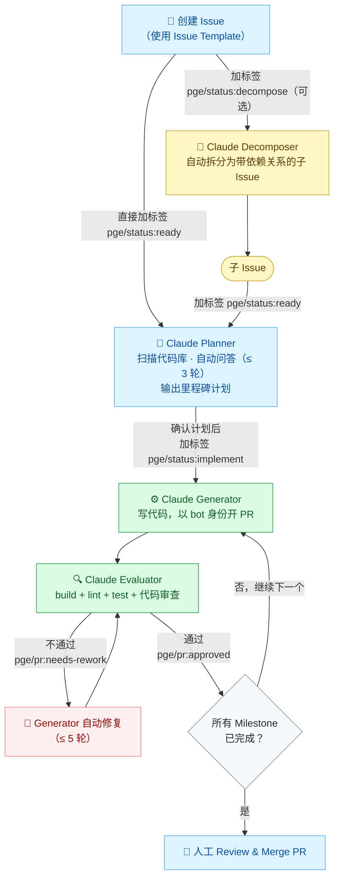

# ai-workflows-hub

AI 驱动的开发工作流公共库。任何 GitHub repo 通过 Reusable Workflows 引用，零基础设施、零运维。

AI 模型调用基于 **AWS Bedrock（Claude）**，通过 GitHub OIDC 免密钥 assume IAM Role。

[English](./README.md) · **中文文档**

📖 **接入指南：** [简体中文](./docs/onboarding/onboarding.zh-CN.md) · [English](./docs/onboarding/onboarding.en.md)

---

## 工作原理

给 Issue 加标签，Claude 自动完成规划、写代码、评审的全流程。



---

## 包含内容

### 引用型（`uses:` 直接引用）

| 文件 | 类型 | 说明 |
|------|------|------|
| `.github/actions/claude-bedrock/` | Composite Action | AWS Bedrock Claude 调用核心（OIDC 认证） |
| `.github/actions/jira-handler/` | Composite Action | 调用 Jira REST API 创建 Issue |
| `.github/actions/teams-handler/` | Composite Action | 发送 Teams 通知 |
| `.github/workflows/pge-plan.yml` | Reusable Workflow | PGE Planner — 分析 Issue，自动问答，生成里程碑计划 |
| `.github/workflows/pge-implement.yml` | Reusable Workflow | PGE Generator + Rework — 实现代码，开 PR |
| `.github/workflows/pge-evaluate.yml` | Reusable Workflow | PGE Evaluator + Milestone Advance — 评审 PR，推进里程碑 |
| `.github/workflows/pge-code-review.yml` | Reusable Workflow | Code Review — 人工 PR 的轻量代码审查 |
| `.github/workflows/pge-decompose.yml` | Reusable Workflow | Decomposer — 将大 Issue 拆分为带依赖关系的子 Issue |
| `.github/workflows/cloudwatch-debug.yml` | Reusable Workflow | CloudWatch 日志轮询 → Claude 分析 → Jira/Teams |

### 复制型（从 `templates/` 复制一次）

| 文件 | 说明 |
|------|------|
| `templates/labels.yml` | PGE 标签体系，用 `scripts/import-labels.sh` 导入 |
| `templates/ISSUE_TEMPLATE/` | Issue 模板（prd / bug / change-request） |
| `templates/CLAUDE.md.template` | CLAUDE.md 骨架 |
| `templates/cursor-skills/clean-code/SKILL.md` | 跨项目代码质量基线 |
| `templates/cursor-skills/refactor/SKILL.md` | 跨项目重构协议 |

---

## 接入新 Repo — 完整步骤

> 💡 **最快路径：** 运行一键安装脚本 `scripts/install.sh`，再按图文步骤指南 [`docs/onboarding/onboarding.zh-CN.md`](./docs/onboarding/onboarding.zh-CN.md)（[English](./docs/onboarding/onboarding.en.md)）操作即可。下面的步骤记录的是手动流程及底层细节。

### 前提条件

- 目标 repo 已托管在 GitHub
- 有 AWS 账号，且已创建 Bedrock 可用的 IAM Role（见步骤 2）
- 本地已安装并登录 [`gh` CLI](https://cli.github.com/)（步骤 5 导入标签时使用）
- 本地有 `ruby`（`scripts/import-labels.sh` 导入标签时使用，macOS 自带）
- 本地已安装 `jq`（`claude-bedrock` action 内部依赖，缺失时会直接报错）

---

### 步骤 1：复制模板文件

最快的方式是用一键安装脚本，它会把标签、Issue 模板、5 个 PGE workflow、验证脚本、全部 7 个 SKILL 和 `CLAUDE.md` 一次性复制到位：

```bash
# 克隆 library
git clone https://github.com/tiankai0114/ai-workflows-hub.git /tmp/ai-workflows-hub

# 进入目标 repo 根目录并运行安装脚本
cd /path/to/your-repo
bash /tmp/ai-workflows-hub/scripts/install.sh
```

<details>
<summary>或手动复制文件</summary>

```bash
cd /path/to/your-repo
cp /tmp/ai-workflows-hub/templates/labels.yml .github/labels.yml
cp -r /tmp/ai-workflows-hub/templates/ISSUE_TEMPLATE .github/ISSUE_TEMPLATE
cp /tmp/ai-workflows-hub/templates/CLAUDE.md.template CLAUDE.md
mkdir -p .cursor/skills
# 复制全部 7 个 SKILL
cp -r /tmp/ai-workflows-hub/templates/cursor-skills/. .cursor/skills/
```
</details>

### 步骤 2：配置 AWS IAM Role（Trust Policy）

在 AWS Console 找到用于 Bedrock 的 IAM Role，编辑 **Trust relationships**，加入以下 Statement（替换 `YOUR_ACCOUNT_ID` 和 `YOUR_ORG/YOUR_REPO`）：

```json
{
  "Effect": "Allow",
  "Principal": {
    "Federated": "arn:aws:iam::YOUR_ACCOUNT_ID:oidc-provider/token.actions.githubusercontent.com"
  },
  "Action": "sts:AssumeRoleWithWebIdentity",
  "Condition": {
    "StringEquals": {
      "token.actions.githubusercontent.com:aud": "sts.amazonaws.com"
    },
    "StringLike": {
      "token.actions.githubusercontent.com:sub": "repo:YOUR_ORG/YOUR_REPO:*"
    }
  }
}
```

> **注意：** `sub` 条件必须包含至少 6 个字符前缀再跟通配符（如 `repo:tiankai0114/search-android-demo-app:*`），不能用 `repo:tiankai0114/*:*` 这样的宽泛通配符，AWS 会拒绝。
>
> 每新增一个 repo 都要在此 Trust Policy 里加一条 `sub` 条件。

IAM Role 还需要附加以下权限 Policy（允许调用 Bedrock）：

```json
{
  "Effect": "Allow",
  "Action": [
    "bedrock:InvokeModel",
    "bedrock:InvokeModelWithResponseStream"
  ],
  "Resource": "*"
}
```

记录 Role ARN，格式为：`arn:aws:iam::YOUR_ACCOUNT_ID:role/YOUR_ROLE_NAME`

---

### 步骤 3：创建 GitHub App（用于 Generator 以 bot 身份提交代码）

> Code Review、Decompose 和 Plan 不需要 GitHub App；Implement、Evaluate 需要。

1. 打开 [github.com/settings/apps/new](https://github.com/settings/apps/new)
2. 填写：
   - **App name**：`your-repo-ci`（建议加 repo 名前缀，全局唯一）
   - **Homepage URL**：`https://github.com/your-org`
   - **Webhook**：取消勾选 Active
3. 设置 **Permissions**（Repository permissions）：
   - Contents: **Read & Write**
   - Issues: **Read & Write**
   - Pull requests: **Read & Write**
4. **Where can this GitHub App be installed**：Only on this account
5. 点击 **Create GitHub App**
6. 记录页面顶部的 **App ID**（数字）
7. 往下滚动，点 **Generate a private key** → 下载 `.pem` 文件

**安装 App 到目标 repo：**

1. 左侧菜单点 **Install App**
2. 点账号旁边的 **Install**
3. 选择 **Only select repositories** → 选目标 repo → 确认

**查询 bot 的数字 User ID：**

```bash
# 把 your-app-name 替换为 App name（小写，空格换连字符）
curl https://api.github.com/users/your-app-name%5Bbot%5D | grep '"id"'
```

或浏览器访问：`https://api.github.com/users/your-app-name[bot]`

记录返回的 `"id"` 值（即 `bot_id`）。

---

### 步骤 4：在目标 repo 添加 Secrets

打开目标 repo → **Settings → Secrets and variables → Actions → New repository secret**：

| Secret 名 | 值 | 必须 |
|-----------|-----|------|
| `GH_APP_ID` | GitHub App 的数字 ID | Implement / Evaluate |
| `GH_APP_PRIVATE_KEY` | `.pem` 文件完整内容（含头尾行） | Implement / Evaluate |
| `FIGMA_TOKEN` | Figma Personal Access Token | 可选，有 Figma 设计稿时使用 |

---

### 步骤 5：导入 PGE 标签

`gh label import` 并不是 gh 的原生命令，因此改用辅助脚本：它会逐条读取 `labels.yml`，用 `gh label create --force` 创建/更新每个标签（可安全重复运行）。需要 `gh`（已登录）和 `ruby`。

```bash
cd /path/to/your-repo

# gh auth login：提示输入 token 时，选择 Generate new token (classic)，
# 权限勾选 read:org、repo
gh auth login

# 自动识别 git remote 的 owner/repo
bash /tmp/ai-workflows-hub/scripts/import-labels.sh
```

---

### 步骤 6：开启 Actions 写权限

Generator / Evaluator 需要以 Actions 身份创建分支、开 PR，必须在 repo 设置里放开权限，否则 workflow 会因权限不足而失败。

打开目标 repo → **Settings → Actions → General → Workflow permissions**：

1. 选中 **Read and write permissions**
2. 勾选 **Allow GitHub Actions to create and approve pull requests**
3. 点击 **Save** 保存

> **注意：**「允许 Actions 创建 PR」是仓库级开关，即使 workflow 里已声明 `permissions:` 也无法覆盖，因此必须在此手动开启。

---

### 步骤 7：提交 Issue Templates 到默认分支

Issue Templates 必须在默认分支上才在 GitHub 的 "New Issue" 页面生效：

```bash
git add .github/ISSUE_TEMPLATE .github/labels.yml CLAUDE.md .cursor/
git commit -m "chore: add PGE issue templates, CLAUDE.md and skill files"
git push origin main   # 或 master，视你的默认分支
```

---

### 步骤 8：添加触发 Workflow 文件

> 若已运行 `install.sh`（步骤 1），这 5 个 workflow 文件已复制到 `.github/workflows/`，只需替换下方占位符即可。此处完整 YAML 供参考 / 手动配置。

在目标 repo 的 `.github/workflows/` 下创建以下文件，替换 `YOUR_ROLE_ARN`、`YOUR_BOT_NAME`、`YOUR_BOT_ID`：

**`pge-code-review.yml`** — 人工 PR 自动代码审查

```yaml
name: "PGE: Code Review"
on:
  pull_request:
    types: [opened, synchronize, ready_for_review, reopened]
jobs:
  review:
    if: |
      !endsWith(github.event.pull_request.user.login, '[bot]') &&
      !contains(github.event.pull_request.title, '[Milestone') &&
      !endsWith(github.event.sender.login, '[bot]')
    uses: tiankai0114/ai-workflows-hub/.github/workflows/pge-code-review.yml@v1
    with:
      aws_role: "YOUR_ROLE_ARN"
```

**`pge-decompose.yml`** — 将大 Issue 拆分为子 Issue

```yaml
name: "PGE: Decompose"
on:
  issues:
    types: [labeled]
jobs:
  decompose:
    if: github.event.label.name == 'pge/status:decompose'
    uses: tiankai0114/ai-workflows-hub/.github/workflows/pge-decompose.yml@v1
    with:
      aws_role: "YOUR_ROLE_ARN"
```

**`pge-plan.yml`** — 分析 Issue，生成实现计划

```yaml
name: "PGE: Planner"
on:
  issues:
    types: [labeled]
jobs:
  plan:
    if: github.event.label.name == 'pge/status:ready'
    uses: tiankai0114/ai-workflows-hub/.github/workflows/pge-plan.yml@v1
    with:
      aws_role: "YOUR_ROLE_ARN"
      bot_id: "YOUR_BOT_ID"
      bot_name: "YOUR_BOT_NAME[bot]"
    secrets:
      figma_token: ${{ secrets.FIGMA_TOKEN }}
```

**`pge-implement.yml`** — 实现代码 + Rework

```yaml
name: "PGE: Generator"
on:
  issues:
    types: [labeled]
  pull_request:
    types: [labeled]
jobs:
  run:
    if: |
      (github.event_name == 'issues' && github.event.label.name == 'pge/status:implement') ||
      (github.event_name == 'pull_request' && github.event.label.name == 'pge/pr:needs-rework')
    uses: tiankai0114/ai-workflows-hub/.github/workflows/pge-implement.yml@v1
    with:
      aws_role: "YOUR_ROLE_ARN"
      bot_id: "YOUR_BOT_ID"
      bot_name: "YOUR_BOT_NAME[bot]"
      mode: ${{ (github.event_name == 'pull_request' && github.event.label.name == 'pge/pr:needs-rework') && 'rework' || 'implement' }}
      pr_number: ${{ github.event.pull_request.number || '' }}
      # evaluator_workflow_name 默认值为 "PGE: Evaluator"，
      # 若 pge-evaluate.yml 的 name: 字段自定义了名称，需在此同步修改
      # evaluator_workflow_name: "PGE: Evaluator"
    secrets:
      github_app_id: ${{ secrets.GH_APP_ID }}
      github_app_private_key: ${{ secrets.GH_APP_PRIVATE_KEY }}
      figma_token: ${{ secrets.FIGMA_TOKEN }}
```

**`pge-evaluate.yml`** — PR 评审 + 里程碑推进

```yaml
name: "PGE: Evaluator"
on:
  pull_request:
    types: [opened, synchronize, closed]
  pull_request_review:
    types: [submitted]
  workflow_dispatch:
    inputs:
      pr_number:
        required: true
        type: string
jobs:
  human-rework:
    if: |
      github.event_name == 'pull_request_review' &&
      github.event.review.state == 'changes_requested' &&
      endsWith(github.event.pull_request.user.login, '[bot]')
    uses: tiankai0114/ai-workflows-hub/.github/workflows/pge-evaluate.yml@v1
    with:
      aws_role: "YOUR_ROLE_ARN"
      bot_id: "YOUR_BOT_ID"
      bot_name: "YOUR_BOT_NAME[bot]"
      mode: "human-rework"
      pr_number: ${{ github.event.pull_request.number }}
    secrets:
      github_app_id: ${{ secrets.GH_APP_ID }}
      github_app_private_key: ${{ secrets.GH_APP_PRIVATE_KEY }}
  evaluate:
    if: |
      github.event_name == 'workflow_dispatch' ||
      (github.event.action == 'opened' && endsWith(github.event.pull_request.user.login, '[bot]')) ||
      (github.event.action == 'synchronize' && !endsWith(github.event.sender.login, '[bot]') && endsWith(github.event.pull_request.user.login, '[bot]'))
    uses: tiankai0114/ai-workflows-hub/.github/workflows/pge-evaluate.yml@v1
    with:
      aws_role: "YOUR_ROLE_ARN"
      bot_id: "YOUR_BOT_ID"
      bot_name: "YOUR_BOT_NAME[bot]"
      mode: "evaluate"
      pr_number: ${{ github.event.inputs.pr_number || github.event.pull_request.number }}
    secrets:
      github_app_id: ${{ secrets.GH_APP_ID }}
      github_app_private_key: ${{ secrets.GH_APP_PRIVATE_KEY }}
      figma_token: ${{ secrets.FIGMA_TOKEN }}
  milestone-advance:
    if: |
      github.event.action == 'closed' &&
      github.event.pull_request.merged == true &&
      contains(github.event.pull_request.title, '[Milestone')
    uses: tiankai0114/ai-workflows-hub/.github/workflows/pge-evaluate.yml@v1
    with:
      aws_role: "YOUR_ROLE_ARN"
      bot_id: "YOUR_BOT_ID"
      bot_name: "YOUR_BOT_NAME[bot]"
      mode: "milestone-advance"
      pr_number: ${{ github.event.pull_request.number }}
    secrets:
      github_app_id: ${{ secrets.GH_APP_ID }}
      github_app_private_key: ${{ secrets.GH_APP_PRIVATE_KEY }}
```

把这些文件 commit 并 push 到默认分支即可生效。

---

## CloudWatch 日志监控接入（可选）

```yaml
# .github/workflows/cloudwatch-monitor.yml
name: "CloudWatch Log Monitor"
on:
  schedule:
    - cron: '*/15 * * * *'
  workflow_dispatch:
jobs:
  monitor:
    uses: tiankai0114/ai-workflows-hub/.github/workflows/cloudwatch-debug.yml@v1
    with:
      aws_role: "YOUR_ROLE_ARN"
      log_group: "/aws/lambda/your-function"
      filter_pattern: "ERROR"
      start_time_offset_minutes: 20
      handler: "jira"
      jira_base_url: "https://your-org.atlassian.net"
      jira_project_key: "OPS"
      jira_user_email: "ci-bot@your-org.com"
    secrets:
      jira_api_token: ${{ secrets.JIRA_API_TOKEN }}
```

---

## 版本管理

使用 `@v1` 引用浮动稳定版。主分支持续更新，建议生产环境固定到具体 tag。

```bash
# 发布新版本
git tag v1.x.x && git push origin v1.x.x

# 移动浮动 tag（v1 始终指向最新稳定版）
git tag -f v1 && git push origin v1 --force
```

---

## 参考：demo repo 实际配置值

以 `tiankai0114/search-android-demo-app` 为例（实际值保存在 repo secrets 中，不在此公开）：

| 参数 | 示例格式 |
|------|----|
| `aws_role` | `arn:aws:iam::<ACCOUNT_ID>:role/<ROLE_NAME>` |
| `bot_name` | `your-app-name[bot]` |
| `bot_id` | 通过 `https://api.github.com/users/your-app-name[bot]` 查询 `id` 字段 |
| GitHub App ID（`GH_APP_ID`） | GitHub App 创建后页面顶部显示的数字 |
| App name | 创建 GitHub App 时填写的名称 |
